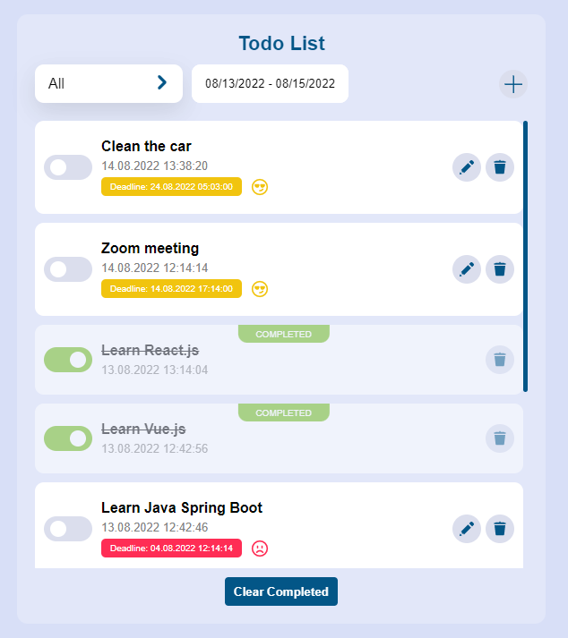

# ToDo-App
Todo-App it is a project by using React ,Redux, Typescript, Axios, JsonServer, Styled-Components

**[Click to see](https://todo-app-58.herokuapp.com/)** (by Heroku)!



# React Todo App.

---

## Project Description

In the project we will be using `React.js` and `redux` to state management, we will be creating a Complete Todo Application with all features such as editing, adding, deleting tasks.
And also using eslint, prettier. 

```shell
npm install
```

and after that start the dev server.

### `npm run dev`

Runs the app in the development mode.\
Open [http://localhost:3000](http://localhost:3000) to view it in the browser.

The page will reload if you make edits.\
You will also see any lint errors in the console.